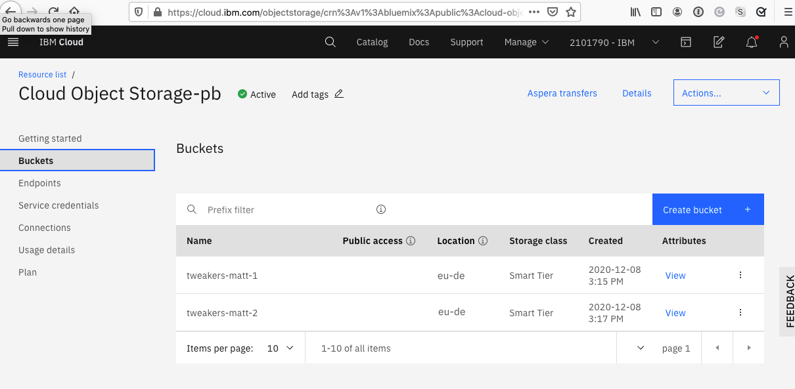
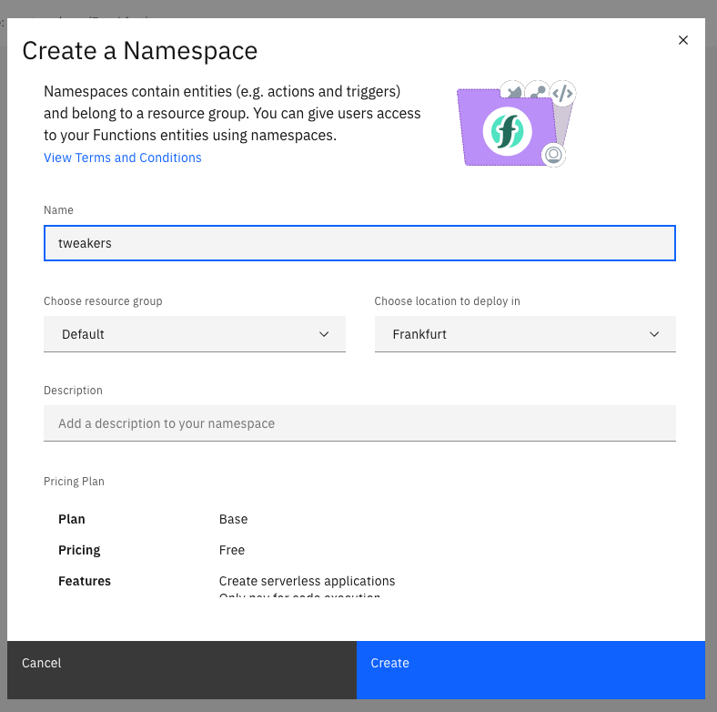
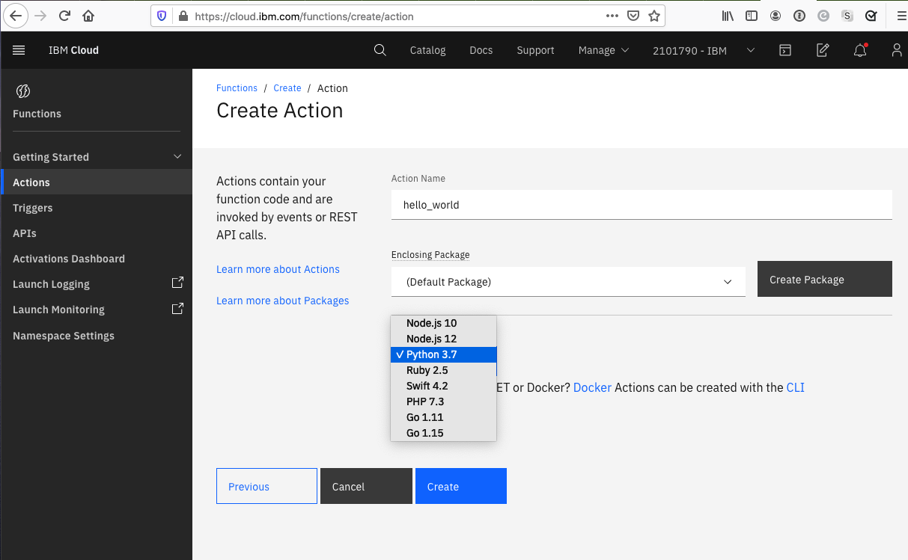

# Hands on IBM Cloud Functions
This is a hands-on workshop walking through creating and using IBM Cloud Functions to process video files stored in IBM Cloud Object Storage. This workshop was originally created for the Tweakers group in the Netherlands.

## Pre-requisites

1. You will need an IBM Cloud account, which you can get for free signing up here: https://ibm.biz/ibm-cloud-functions-account-reg
2a. You will either need to install the IBM Cloud CLI locally: https://www.ibm.com/cloud/cli or
2b. You can use the IBM Cloud Shell in your web browser: https://cloud.ibm.com/shell *(ensure you change the location to `Frankfurt` if not already there)*
3. log into IBM Cloud via the CLI and target the default group:

```bash
$ ibmcloud login --sso
$ ibmcloud target -g Default --cf
```


4. (If installing locally) Install the cloud functions and object storage plugins

```bash
$ ibmcloud plugin install cloud-functions
$ ibmcloud plugin install cloud-object-storage
```

## Create a Cloud Object Storage instance

1. From the [IBM Cloud](https://cloud.ibm.com) homepage, click on the catalog and choose 'Cloud Object Storage'
  

2. Create your free instance of Object Storage.
  

3. Create a bucket that we will need for this workshop, give each bucket a name, and ensure that the resilience is
set to *regional* and set `eu-de` as the region. 
  
  

4. Repeat the step above again to create a second bucket.

5. We should have two buckets now:
  

6. Create some service credentials for us to use later in our cloud functions. Click on "service credentials" on the left
  

7. Click blue "New credential" button top right of screen. The default name and role (writer) are good. *Ensure that you enable "Include HMAC Credential"*
  

## Create a trigger for our cloud storage instance

1. Click the Cloud Functions icon in the left menu: \
  


2. Click on 'Start Creating' and then 'Trigger':
  

3. Click on 'Cloud Object Storage' to create a Trigger for our COS instance:
  

4. Click the link 'Grant Service Authorization'
  

5. Fill in the details of the authorization grant. The Source Serive is `Functions`, the Source service instance in the namespace you created `tweakers`. The target service is `Cloud Object Storage` and the Service instance the name of the COS instance you created earlier. Select the `notifications manager` checkbox at the bottom and click 'Create'
  

6. Refresh our triggers page and you should now be able to give the trigger a name `cos_trigger` and the COS instance should be selected. Ensure your first bucket is selected. Click `Create`
  

# Creating a simple 'hello world' function via the Web Console

1. Click the Cloud Functions icon in the left menu: \
  

2. IMPORTANT: Create a new namespace for our functions:
  

3. Give your namespace the name `tweakers` and choose the location, in this case we will use `London` to match our Object Storage.
  

4. Click on 'Start Creating' on the IBM Cloud Functions homepage
  

5. Click on 'Action' form the list of entities
  

6. Name your action `hello_world` and pick a runtime, in this case `python 3.7`:
  

7. You will be taken to a page in which you can edit code yourself and click 'Invoke' to run it
  

8. Actions take a dictionary parameter in which arguments to the function are marshalled. You can change the code to take a name, e.g.:

    ```python
    import sys

    def main(dict):
        name = dict.get('name', 'Random Bob')
        return { 'message': f'Hello {name}'}
    ```

9. Click on 'Invoke with parameters' to set the parameters for the call
  

10. Click 'Invoke' to now run the action with the parameters
  


## Calling our function from the CLI

1. First we need to target the Default resource group
    ```bash
    % https://cloud.ibm.com/shell
    

1. First we need to target the `tweakers` namespace
    ```bash
    % ibmcloud fn namespace target tweakers
    ok: whisk namespace set to tweakers
    ```

2. We can list our functions, we should see the one we just created:
    ```bash
    % ibmcloud fn action list
    actions
    /25ec8f7a-8e10-422a-94bf-7e7f8d7d8fd9/hello_world                      private python:3.7
    ```

3. We can invoke our action from the CLI:
    ```bash
    % ibmcloud fn action invoke hello_world --result
    {
        "message": "Hello Random Bob"
    }
    % ibmcloud fn action invoke hello_world --result --param name Matt
    {
        "message": "Hello Matt"
    }
   ```

4. We can also list our trigger we created at the start:
    ```bash
    % ic fn trigger list
    triggers
    /25ec8f7a-8e10-422a-94bf-7e7f8d7d8fd9/cos_trigger                      private
    ```

5. Download the example python code to convert a movie to a sound file:
    ```bash
    % curl https://raw.githubusercontent.com/IBMDeveloperUK/Hands-on-IBM-Cloud-Functions/main/convert_format.py -o convert_format.py
    ```

6. Create a package for our functions called `tweakers` in which we will set various default parameters
    ```bash
    % ic fn package create tweakers --param geo eu-de --param endpoint s3.private.eu-de.cloud-object-storage.appdomain.cloud
    ```

7. Bind the service credentials from our COS instance to the package so our function can read/write to our COS buckets
    ```bash
    % ibmcloud fn service bind cloud-object-storage tweakers --instance "Cloud Object Storage-pb"
    ```
    
8. Create our action. This action uses a docker image, that has `ffmpeg` installed. We set the parameters for our buckets as above. Change them for the names you created. We also give it 2GB of RAM and a 10 minute timeout in case we want to process large files.
    ```bash
    % ic fn action update tweakers/convert_format convert_format.py --docker choirless/choirless_py_actions:release-0.23 --timeout 600000 --memory 2048 --param bucket1 tweakers-matt-1 --param bucket2 tweakers-matt-2
    ```

9. Upload a test movie to our first cost bucket (`tweakers-matt-1` in my case) by dragging and dropping it in the bucket view in the web

10. Test our function manually. Give it the name of the file you uploaded before
    ```bash
    % ic fn action invoke convert_format --param key matt.mkv --result
    ```

11. Check in the second COS bucket, you should see a `.wav` file. This is our converted file.

12. To hook the trigger up to the action so it fires automatically, you need to create a rule to link the two:

    ```bash
    % ic fn rule create bucket_upload_rule cos_trigger tweakers/convert_format
    ```

13. Test it by dragging another file (or the same again) to the first COS bucket. You will see the new converted file appear in the second bucket. You can also see the activations:
    ```bash
    % ic fn activation list
    Datetime            Activation ID                    Kind      Start Duration   Status          Entity
    2020-12-14 17:11:00 09cac1a2fac748de8ac1a2fac7d8dea8 blackbox  warm  649ms      success         323b2dbb-5...6f7915f/convert_format:0.0.1
    2020-12-14 17:11:00 02ace321c40841fcace321c408a1fc40 unknown   warm  0s         success         323b2dbb-5...6f7915f/cos_trigger:0.0.1
    ```

